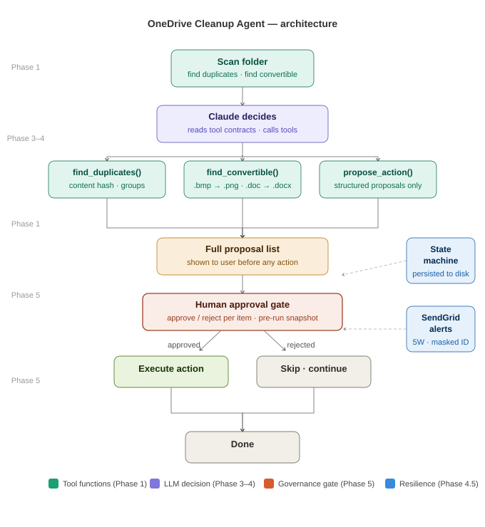

# OneDrive Cleanup Agent (OneDrive AI Agent)

A small AI agent — the **OneDrive AI Agent** — that finds duplicate and
bloated files in a OneDrive folder, proposes clean-up actions, and
executes them — but only after explicit human approval of each action.

Designed, governed, and directed as a Business Analyst / Project Manager
(BA/PM) exercise — with the Python implemented collaboratively with an AI
assistant under that direction — against the Anthropic API. It demonstrates
the core agent loop (tool definition → LLM decision → action → observation)
and the BA/PM discipline applied to a technical build: requirements, design,
risk management, governance, and iterative delivery.

**The repo is a portfolio artefact, not a finished product.** The build
process itself is the point — each phase is committed separately so the
decision-making behind it is visible, not just the outcome.

---

## Why this project

I'm a Delivery Lead and Senior Business Analyst, not a software engineer
by background. This project exists to give me a concrete technical artefact
to point to — built with the same requirements → design → build →
risk/governance discipline I'd bring to any BA/PM deliverable.

Many BA/PM candidates can talk about AI conceptually. Few can point to
something they actually built. Fewer still apply formal PM artefacts
(RAID log, Agile backlog, decision log, two-layer test suite) to the build
process itself.

The OneDrive AI Agent automates a genuinely useful task (deduplicating a
cluttered OneDrive folder), but the real goal is to understand — and be
able to demonstrate — the core loop that underlies tools like Claude Code,
MCP connectors, and Cowork:

**tool definition → LLM decision → action → observation → repeat**

---

## Architecture



The OneDrive AI Agent runs in phases, each building on the last:

```
[Scan folder]
     │
     ▼
[Claude reads tool contracts → decides which tools to call]
     │
     ├──▶ find_duplicates()      ─┐
     ├──▶ find_convertible_files() ┼──▶ [propose_action()]
     └──▶ (loop back if needed)  ─┘
                │
                ▼
     [Full proposal list shown to user]
                │
                ▼
     ┌─────────────────────────┐
     │   HUMAN APPROVAL GATE   │  ◀── pre-run snapshot written first
     │  approve / reject each  │      ("no snapshot, no actions")
     └─────────────────────────┘
          │             │
       approved       rejected
          │             │
     [Execute]      [Skip · continue]
          │             │
          └──────┬──────┘
                 ▼
              [Done]

Supporting layer (Phase 4.5):
  State machine   — designed for restart-and-resume, persisted to disk
                    at each step (see correction below — not yet wired
                    into the live path)
  SendGrid alerts — 5W incident framework, masked user ID, per-error
                    troubleshooting steps
```

**Correction (2026-07-19, RAID I16):** the state machine above is
correctly designed and unit-tested in isolation, but the Phase 8 pilot
found it was never actually wired into the live scripts (`agent_loop.py`,
`approval_gate.py`) — so `agent_state.json` is never written during a
real run, and a restart does not literally resume from a saved state.
The practical safety guarantee still holds (verified empirically — an
unplanned crash never causes unapproved execution, via "always restart
clean"), but the live-persistence mechanism itself is not yet proven
live. Full detail: `PILOT_SIGNOFF_SUMMARY.md`.

**User roles:** single-user model — the person running the OneDrive AI
Agent is also the approver. A multi-role model (separate operator and approver,
role-based alert routing) is a logged future consideration, not an
unconsidered gap (see BACKLOG.md item #5).

---

## Build plan

| Phase | What it covers | Status |
|---|---|---|
| 1 | Plain Python tool functions — scanning, duplicate detection, format-conversion candidates, proposed actions | ✅ Complete |
| 2 | JSON-schema tool contracts for each function (the format used by MCP and the Anthropic API) | ✅ Complete |
| 3 | The decision loop — live Anthropic API call; Claude reads contracts and returns structured tool calls | ✅ Complete |
| 4 | Full execution loop — decide, execute, observe, repeat; all 5 proactive-design risks handled explicitly | ✅ Complete |
| 4.5 | Resilience & Alerting — SendGrid email alerts (5W incident framework), state machine with restart-and-resume for load-shedding resilience | ✅ Complete |
| 5 | Human-approval gate — pre-run manifest snapshot, full proposal review, per-item approve/reject | ✅ Complete |
| 6 | Polish — full README, architecture diagram, repo public | ✅ Complete |
| 7 | Comparison against Claude Cowork (Anthropic's own production agentic tool) — evaluate this self-directed OneDrive AI Agent build against a finished product | ✅ Complete |
| 8 | UAT / Pilot — validate the OneDrive AI Agent against a real, limited subset of live OneDrive data before full production rollout | ✅ Complete — signed off 2026-07-20 |

---

## This project mapped to standard SDLC terminology

Applied retrospectively, for readers more familiar with formal SDLC
framing than with this project's own phase numbering:

| SDLC Phase | Maps to (this project) | Key artefacts |
|---|---|---|
| Planning | Phase 0 (setup, scope) | Handoff document v1.0 |
| Requirements & Analysis | Phase 1 | `tools.py`, Decision log entries |
| Design | Phase 2 | `tool_contracts.py` (interface/technical design) |
| Development | Phases 3, 4, 4.5, 5 | `decision_loop.py`, `agent_loop.py`, `resilience.py`, `approval_gate.py` |
| Testing / QA | Pre-Phase-5 gate, `test_phase2.py`, `test_phase3_4_45.py`, Phase 7 (Cowork as independent validation) | Test suites, `docs/REMEDIATION_2026-07-02_cowork-peer-review.md` |
| **UAT / Pilot** | **Phase 8 (complete — signed off 2026-07-20)** | Validation against a real, limited OneDrive subset before full rollout — see `PILOT_SIGNOFF_SUMMARY.md` |
| Deployment | Full OneDrive rollout (future) | — |
| Maintenance | Ongoing | `BACKLOG.md`, `RAID_LOG.md` |

**Honest note on fit:** Phase 6 (polish, documentation, public repo) and
Phase 7 (Cowork comparison) don't map cleanly onto a single classic SDLC
phase — Phase 6 sits closer to release/documentation preparation, and
Phase 7 functions as an additional, independent testing/validation step
rather than a distinct lifecycle stage. Noted here honestly rather than
forcing a clean fit that isn't quite accurate.

**Terminology note:** this stage is deliberately labelled **UAT/Pilot**,
not "Proof of Concept (POC)." A POC proves a concept is technically
feasible, typically done early on synthetic or minimal data — that was
effectively already covered by Phases 1–4 against `sample_data/`. UAT/Pilot
validates an already-built, already-tested solution against real data and
conditions immediately before full production rollout, which is what this
stage is for.

---

## Design philosophy: proactive design, not lucky edge-case handling

A recurring risk in agent-style code is writing something that happens to
work because of how a loop or data structure is shaped — without having
deliberately decided to handle that scenario.

This project draws an explicit line between two categories:

**Things that will reliably occur**, given how an LLM-driven agent
behaves — e.g. the model returning zero, one, or several tool calls in
a single turn; malformed tool arguments; an unrecognised tool name; a
loop that needs an explicit stopping condition; real API/network failures
— are designed for deliberately, with a stated reason, before they cause
a problem.

**Things that are rare or out of scope** for what this project
demonstrates are explicitly *not* engineered for, on purpose:
- Extremely large folders (thousands of files) — sample-data scale is
  sufficient for a portfolio demo
- Multi-user/concurrent access — not relevant; this is a single-user tool
- Internationalization/unicode edge cases beyond what `pathlib` handles

This distinction itself is meant to be visible: the goal is recognising
which risks are real for an LLM-driven tool-calling loop specifically,
and building for those on purpose.

---

## Governance and risk management

This project applies BA/PM discipline to a technical build — not just to
the code, but to the process itself:

- **RAID_LOG.md / docs/RAID_Log.xlsx** — Risks, Assumptions, Issues, and
  Dependencies tracked live throughout the build and the pilot,
  including issues found and root-caused by an independent reviewer
  (see below)
- **BACKLOG.md** — Agile Product Backlog and Daily Scrum log, including
  retrospective notes on what went wrong and what process changes resulted
- **Decision log** (in the handoff document) — every design trade-off
  recorded with options considered, key trade-off, and choice made
- **Pre-run manifest snapshot** — `pre_run_snapshot.json` written before
  any destructive action executes, recording each affected file's path,
  size, and MD5 hash as an audit trail. "No snapshot, no actions" is a
  hard precondition, not an optional extra
- **DR/rollback** — OneDrive's built-in recycle bin and version history
  accepted as the primary recovery mechanism (proportionate); the manifest
  snapshot provides agent-level audit without redundant file copying

---

## Testing approach

Every phase that introduces new functions is tested in two ordered layers:

1. **Unit tests** — each function tested in isolation, including realistic
   negative/red-line cases (empty input, missing folders, near-miss false
   positives, corrupted state files, invalid API keys, disk write failures)
2. **Integration tests** — functions tested chained together, with data
   flowing as it will in the real agent loop

The test suite scales with the project across three files — `test_phase2.py`
(Phases 1–2), `test_phase3_4_45.py` (Phases 3–5), and `test_phase8_pre_pilot.py`
(Phase 8 pre-pilot checks) — spanning both unit and integration layers, all
passing. Unit tests run first; if any fail, integration tests are skipped and
flagged as not meaningful until the unit layer is clean.

**Independent peer review (2026-07-02):** as an additional check beyond
this project's own test suite, Claude Cowork was asked to independently
review every project file for syntax validity, internal consistency, and
README clarity — without being told what to look for beyond that. Cowork
found and correctly diagnosed a real, previously-unnoticed test isolation
bug: two Phase 5 integration tests were operating on the real `sample_data/`
fixture folder rather than an isolated copy, causing genuine file deletions
on every test run and silent fixture drift. It verified this by actually
running the test suite, not just reading the code, and separately fact-checked
the Phase 7 model comparison claims against live search. All findings were
confirmed accurate and have been fixed (see RAID_LOG.md, Issue I5). This is
itself a small demonstration of the project's own philosophy — verify rather
than assume, and catch problems before they compound.

---

## Current state

- ✅ Phase 1 complete: `tools.py` — four tool functions, tested against a
  sample folder with deliberately planted edge cases (true duplicates, a
  same-name/different-content near-miss, a convertible file format)
- ✅ Phase 2 complete: `tool_contracts.py` — JSON-schema tool contracts
  for all four functions, validated by a two-layer test suite
- ✅ Phase 3 complete: `decision_loop.py` — first live Anthropic API call;
  Claude correctly identified and called two independent tools in the same
  turn, without being told to
- ✅ Phase 4 complete: `agent_loop.py` — full loop run end-to-end; Claude
  called two tools in parallel in iteration 1, chained their results into a
  third call in iteration 2, then correctly stopped on its own in iteration
  3 (natural termination, not the safety-limit fallback)
- ✅ Phase 4.5 complete: `resilience.py` — SendGrid alerting (7 named alert
  functions, 5W incident framework, masked user credentials, README-reference
  pattern on all commands) and an explicit state machine (5 named states,
  state persistence, `AWAITING_HUMAN_APPROVAL` safety guarantee), both
  correctly implemented and unit-tested. **Correction (2026-07-19, RAID
  I16):** the Phase 8 pilot found this state machine was never wired into
  the live scripts, so state is not actually persisted during a real run
  — see the architecture-diagram correction above and `PILOT_SIGNOFF_SUMMARY.md`
- ✅ Phase 5 complete: `approval_gate.py` — proven in a live run: invalid
  input caught and re-prompted, real file deleted on approval, rejected
  action correctly skipped, pre-run snapshot verified with matching MD5 hashes
- ✅ Phase 6 complete: full README, architecture diagram (`architecture.svg`
  rendering inline on the repo landing page), repo switched to Public
- ✅ Phase 7 complete — see Comparison against Claude Cowork below
- 🔍 **Independent peer review (2026-07-02):** Claude Cowork reviewed all
  project files; found and correctly diagnosed a real test isolation bug
  plus three minor documentation drifts. All fixed and verified same day.
  Full account in `docs/REMEDIATION_2026-07-02_cowork-peer-review.md`. The
  OneDrive AI Agent's own model also switched from `claude-sonnet-4-6` to
  `claude-sonnet-5` to align with Claude Chat/Cowork (see handoff document
  Decision log).
- ✅ **Phase 8 complete — signed off 2026-07-20 (test execution completed
  2026-07-19):** UAT/Pilot against a real, limited OneDrive subset. All 19
  green-line/red-line test cases closed, three independently-verified
  checkpoints (CP1/CP2/CP3) passed, and the pilot's most safety-critical
  property — no unapproved execution after an unplanned crash — verified
  empirically. One finding disclosed honestly rather than rounded up: the
  crash-recovery test's originally-specified mechanism (saved-state resume)
  was found not to be wired into the live code path; the behavioural safety
  guarantee is proven, the specific resume mechanism is not yet live
  (tracked as a post-pilot item). `PILOT_SIGNOFF_SUMMARY.md` (full detail)
  recommended sign-off — Nadeem Marshman formally gave it, 2026-07-20 05:46.
- 🟢 **Live run (2026-07-30):** Phase 1's duplicate-detection tool run
  unmodified against a real, live OneDrive folder (`Pictures\Camera Roll`,
  218 files) rather than the disposable sample fixture. Found 2 true
  byte-for-byte duplicate groups (MD5 content hash, not filename matching),
  5.8 MB reclaimable. Read-only — no files deleted; see
  `LIVE_RUN_CAMERA_ROLL.md` and `live_run_camera_roll_dedup.py`.

---

## Release phases (resume links)

This repo is tagged so each phase can be linked separately on a resume,
rather than splitting into multiple repos:

- **[`v1.0-foundational-build`](../../releases/tag/v1.0-foundational-build)**
  — Phases 1-8, closed 2026-07-20. The designed-and-governed build: agent
  loop, tool contracts, approval gate, resilience layer, full BA/PM
  artefact suite, pilot sign-off.
- **[`v2.1-live-run-camera-roll-complete`](../../releases/tag/v2.1-live-run-camera-roll-complete)**
  — the Phase 1 tool run live against real data (`Pictures\Camera Roll`),
  2026-07-30: keeper-selection defect found and worked around, proposal
  drafted, quarantine-move workflow built and executed. This is the link
  to use for this phase — `v2.0-live-run-camera-roll` is an earlier
  in-phase checkpoint (first commit only), kept as-is rather than moved.
  See `Handoff-Briefs/Live-Run-Handoff_v1.0.md` for full detail.
- Further live-run phases against other folders will each get their own
  `vN.0-live-run-{{name}}` tag following the same pattern.

---

## Repo contents

- `tools.py` — Phase 1 tool functions
- `tool_contracts.py` — Phase 2 JSON-schema tool contracts
- `test_phase2.py` — Phase 2 two-layer test suite
- `decision_loop.py` — Phase 3 decision loop (live Anthropic API)
- `agent_loop.py` — Phase 4 full execution loop with structured logging
- `resilience.py` — Phase 4.5 resilience and alerting
- `approval_gate.py` — Phase 5 human-approval gate
- `test_phase3_4_45.py` — Phase 3–5 automated test suite
- `test_phase5_live.py` — end-to-end live test runner (Phases 1–5)
- `test_phase8_pre_pilot.py` — Phase 8 pre-pilot automated checks
- `TEST_STRATEGY.md` — overall test strategy
- `TEST_BED_AND_CASES.md` — Phase 8 pilot test bed and case list (technical
  build/execution recipe)
- `TEST_USE-CASES_PLAIN_ENGLISH.md` — every GB/RB test case restated as a
  plain-English user story, for a non-technical reviewer
- `PILOT_SIGNOFF_SUMMARY.md` — one-page Phase 8 pilot sign-off summary:
  checkpoint results, defects found/fixed, and honest coverage disclosure
- `ONEDRIVE_AGENT_EXEC_PROJECT_SUMMARY.md` / `.docx` — recruiter-facing
  executive summary of the whole project, not just Phase 8
- `PROJECT_CHARTER.md` — retroactively authored project charter (purpose,
  objectives, scope, stakeholders, methodology), dated honestly at closure
- `PROJECT_REQUIREMENTS_TRACEABILITY_MATRIX.md` — every requirement traced
  from charter objective through GB/RB test case to sign-off evidence
- `STAKEHOLDER_REGISTER.md` — who had a stake in the project and how they
  were actually engaged
- `LESSONS_LEARNED.md` — retrospective (what went well / what would be done
  differently), including the folded Scope Evolution & Change Log
- `architecture.svg` — architecture diagram (rendered inline above)
- `LICENSE` — MIT licence
- `sample_data/` — disposable test folder with planted edge cases
- `BACKLOG.md` — Agile Product Backlog and Daily Scrum log
- `RAID_LOG.md` — Risks, Assumptions, Issues, Dependencies (markdown)
- `docs/RAID_Log.xlsx` — Excel version of `RAID_LOG.md`
- `build_raid_log.py` — script that generated `docs/RAID_Log.xlsx`
- `docs/REMEDIATION_2026-07-02_cowork-peer-review.md` — Root Cause Analysis
  and remediation report for findings from an independent Claude Cowork
  peer review (see RAID_LOG.md, Issue I5)
- `GLOSSARY.md` — canonical acronym/abbreviation register for the whole
  project

---

## Project location and key paths

Alert emails reference this table — check here first if an alert tells
you to "see README.md for the correct path."

| Item | Default location |
|---|---|
| Project folder | `C:\Dev\onedrive-agent\` |
| Run the OneDrive AI Agent | `python agent_loop.py` (from the project folder) |
| State file | `agent_state.json` in the project folder |
| Pre-run snapshot | `pre_run_snapshot.json` in the project folder |
| Run logs | `logs\` subfolder inside the project folder |
| Environment variables | Windows User-level — set via PowerShell, persist across sessions |

If you move the project, update this table so alert instructions stay accurate.

---

## Running the OneDrive AI Agent

```
cd C:\Dev\onedrive-agent
python agent_loop.py
```

Requires `ANTHROPIC_API_KEY` and `SENDGRID_API_KEY` set as Windows
User-level environment variables (see README table above for setup).

---

## Comparison against Claude Cowork

**What this is:** After directing the build of the OneDrive AI Agent, the same file-organisation
task was given to Claude Cowork — Anthropic's own production-grade agentic
tool — on the same controlled test data (`sample_data/`). The goal: evaluate
how this directed build compares to a finished product built on the same
underlying loop, and identify what each does that the other doesn't.

**Models used:**
- This directed OneDrive AI Agent build (Phases 3–5, as originally built and tested): `claude-sonnet-4-6`
  (released February 2026) — chosen at the time because it was accessible on
  the free tier during an early, budget-constrained phase of this project
- Claude Cowork (Phase 7): `claude-sonnet-5` (released June 30, 2026 — the
  day before this comparison was run)
- **Post-comparison update:** once this project demonstrated enough value to
  justify a paid Claude subscription, and the Phase 7 comparison surfaced a
  model-version mismatch between the OneDrive AI Agent's API calls and
  Claude Chat/Cowork (both already on Sonnet 5), its model string was
  switched to `claude-sonnet-5` in `decision_loop.py` and `agent_loop.py`.
  All three surfaces — Claude Chat, Claude Cowork, and the OneDrive AI
  Agent's own API calls — are now aligned on Sonnet 5. See handoff document Decision log (item 7)
  for the full trade-off record.
- **Key capability difference (Sonnet 4.6 → Sonnet 5):** Sonnet 5 is a direct
  upgrade over Sonnet 4.6, with its largest gains in agentic tasks and coding
  (+5.1 points on SWE-bench Pro: 63.2% vs 58.1%, [source](https://www.anthropic.com/news/claude-sonnet-5));
  both models share the same 1M token context window and tool-use architecture,
  so the core agent loop mechanics are comparable — the difference is in
  reasoning depth and reliability on complex tasks, not in the fundamental
  approach.

**Task given to Cowork** (verbatim):
> "I have a folder at C:\Dev\onedrive-agent\sample_data that contains some
> files. Please scan it, identify any duplicate files and any files in old
> or bloated formats that could be converted to better alternatives, and
> propose what actions you'd take. Don't do anything yet — just show me
> your findings and proposed actions first."

### What Cowork found

Cowork correctly identified:
- `original_notes.txt` and `subfolder/nested/another_copy.txt` as
  byte-for-byte identical (same MD5) — one redundant
- `original_notes_v2.txt` as a near-miss — similar name, but different
  content (Q1 vs Q2 planning notes) — correctly excluded as a non-duplicate
- `old_photo.bmp` as a conversion candidate (BMP → PNG or JPEG)
- `resume_draft.docx` as already modern — no action needed

Cowork also added one recommendation outside the defined task scope:
rename `original_notes_v2.txt` to something clearer (e.g.
`original_notes_q2.txt`) to avoid confusion with a versioned copy.

### Comparison

| Dimension | This directed OneDrive AI Agent build | Claude Cowork |
|---|---|---|
| Model | `claude-sonnet-4-6` | `claude-sonnet-5` (Sonnet 5, released 2026-06-30) |
| Duplicate detection | MD5 content hash via Python | MD5 content hash via file inspection |
| Near-miss handling | Correctly excluded | Correctly excluded |
| Proposal format | Structured JSON (`propose_action()`) | Natural language list |
| Approval gate | Explicit per-item y/n prompt with pre-run manifest snapshot | Permission prompt on deletion |
| Audit trail | `pre_run_snapshot.json` (path, size, MD5, timestamp per affected file) | Not visible to user |
| Structured logging | `INFO`/`WARNING`/`ERROR` to timestamped log file per run | Not visible to user |
| Email alerting | SendGrid, 7 named alert functions, 5W incident framework | Not present |
| State machine | Explicit 5-state machine, designed and unit-tested for persisted restart-and-resume — not yet wired into the live path (see Current state, Phase 4.5, above) | Not present |
| Rename suggestions | Not in scope | Added proactively |
| Underlying mechanics | Fully visible — tool contracts, decision loop, state transitions in code | Production black box |

### What this tells us

**On findings:** Cowork reached the same conclusions on every test case —
same duplicate identified, same near-miss correctly excluded, same conversion
candidate flagged. The core OneDrive AI Agent logic in this governed build is validated
against a production tool.

**On governance:** Where this directed build differs from Cowork is not
in *what* it finds, but in *how it governs* what it does with those findings.
The explicit audit trail, structured logging, email alerting on failure, and
state-machine resilience for power outages are deliberate engineering choices
with stated reasons — none of these are visible in Cowork's output. This
reflects the BA/PM framing of the project: the governance layer is as
important as the functional output.

**On transparency:** Directing the OneDrive AI Agent's build end-to-end makes the underlying
mechanics inspectable. Cowork is a polished, production-capable tool;
this directed build is a learning and demonstration artefact. Both
are useful — for different purposes.

**On scope:** Cowork's proactive rename suggestion shows one area where
a production tool adds value beyond the defined task — general-purpose
reasoning applied opportunistically. This BA/PM-directed OneDrive AI Agent only does what
it was explicitly designed to do, which is appropriate for a controlled,
governed pipeline but less flexible than a general-purpose agent.
